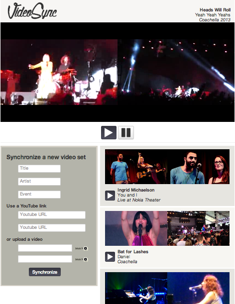
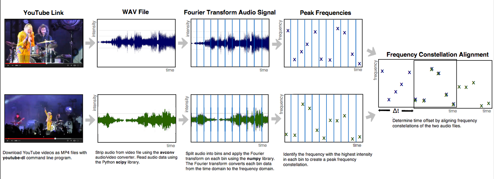

VideoSync
=========

This VideoSync web application automatically synchronizes and combines personal and crowd-sourced YouTube video clips to recreate a live concert experience from multiple angles. 

###Align Audio
#####(alignment.py)
Video alignment is determined by applying signal processing methods to the audio portion of the file and uses time-frequency constellation analysis to determine when the songs overlap.

###Web Application
#####(app.py)
The web application is set up using python's Flask framework. Users are able to view previously aligned videos and synchronize new ones. New videos can be uploaded by users or linked from YouTube.

###Database
#####(model.py & tracks.db)
The SQLite database is used to store a library of information about previously analyzed and synchronized videos, including track title, artist, live event, the delay between videos, and YouTube link details. The database model is set up and maintained using SQLAlchemy.

###User Interface
#####(index.html, watch.html, videoSync.js)
The front end utilizes HTML5, Bootstrap, JavaScript, and the YouTube Player API. These files are stored in the templates folder.

